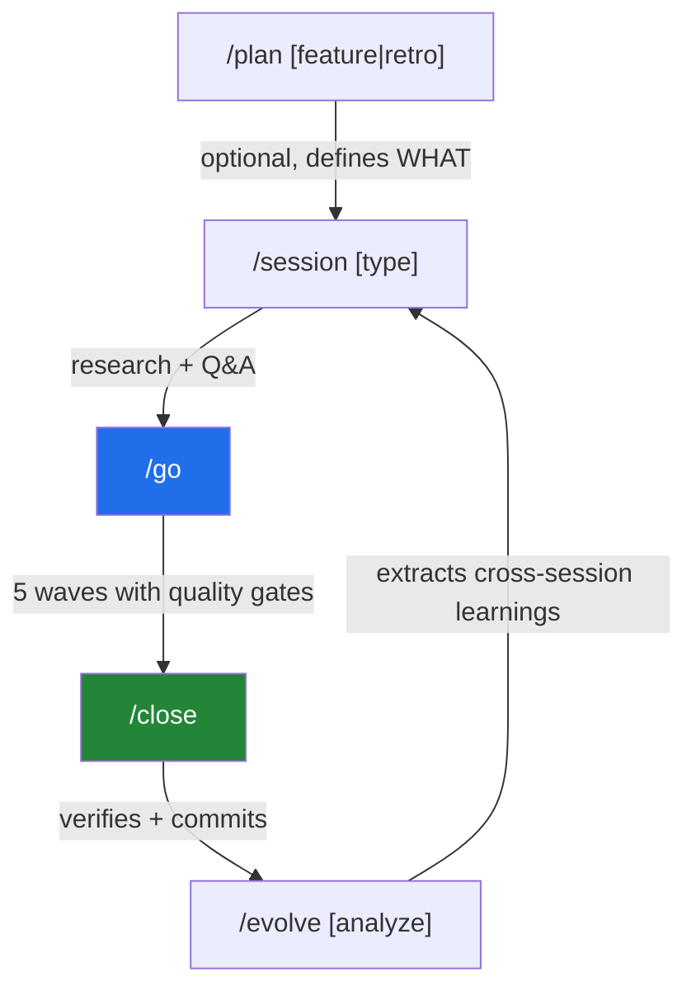
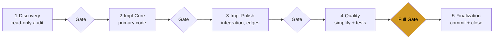

# Session Orchestrator

[](LICENSE)
[](CHANGELOG.md)
[](https://www.npmjs.com/package/session-orchestrator)
[](docs/telemetry/telemetry-claims.md)

Loop engineering for AI coding agents — turn ad-hoc sessions into a repeatable research → plan → wave-execute → close loop with verification gates. Runs on **Claude Code, Codex CLI, Cursor, and [Pi](docs/pi-setup.md)**.

The same skills and commands run across all four, with platform-adapted hooks and enforcement (see [Platform support](#platform-support)). Community plugin (MIT, community-maintained) for solo devs and small teams.

## Install

> **Prerequisite:** Node.js 24 or later (`node --version`). v3.x runs as ES modules and needs a real Node runtime. [Install Node.js](https://nodejs.org/).

| Platform | Install |
|---|---|
| **Claude Code** | `/plugin marketplace add Kanevry/session-orchestrator` then `/plugin install session-orchestrator@kanevry` (run both inside Claude Code). Also listed on the official community catalog: `/plugin install session-orchestrator@claude-community` (that catalog can lag HEAD). |
| **Codex CLI** | `git clone https://github.com/Kanevry/session-orchestrator.git ~/Projects/session-orchestrator && cd ~/Projects/session-orchestrator && npm install && node scripts/codex-install.mjs` |
| **Cursor IDE** | `git clone https://github.com/Kanevry/session-orchestrator.git ~/Projects/session-orchestrator && cd ~/Projects/session-orchestrator && npm install && node scripts/cursor-install.mjs /path/to/your/project` |
| **Pi** | `pi install npm:session-orchestrator` — or dev-fallback: `git clone https://github.com/Kanevry/session-orchestrator.git ~/Projects/session-orchestrator && cd ~/Projects/session-orchestrator && npm install && node scripts/pi-install.mjs /path/to/your/project --settings-only` |

For Claude Code, also install Node dependencies **once** (hooks import `zx`) and restart Claude Code:

```bash
# Claude Code has no `plugin dir` subcommand, so resolve the install path from the cache.
SO_DIR="$(dirname "$(find ~/.claude/plugins/cache -path '*session-orchestrator*' -name package.json 2>/dev/null | head -1)")"
cd "$SO_DIR" && npm install
```

If `SO_DIR` comes back empty, the plugin is not installed from a marketplace — check
`/plugin list` inside Claude Code first.

Setup guides: [Codex](docs/codex-setup.md) · [Cursor IDE](docs/cursor-setup.md) · [Pi](docs/pi-setup.md). Per-IDE notes on `CLAUDE.md` vs `AGENTS.md`: [instruction-file-resolution](skills/_shared/instruction-file-resolution.md).

## What makes it different

- **Verification gates** — every wave ends at a typecheck/lint/test gate; a confidence-filtered session-reviewer catches regressions between waves, not only at the end.
- **Wave orchestration** — five typed roles (Discovery → Impl-Core → Impl-Polish → Quality → Finalization), parallel subagents inside each wave, not one big batch.
- **Persistent memory & learnings** — `STATE.md` survives crashes and resumes the next session; `/evolve` extracts confidence-scored patterns across sessions, nothing hidden.
- **Multi-harness** — the same skills and commands run on Claude Code, Codex CLI, Cursor IDE, and Pi, with platform-adapted hooks and enforcement.

## A session in three commands

```text
/session feature    # research + Q&A — inspect git, issues, history, then agree on scope
/go                 # execute in five typed waves (fixed roles), with a quality gate between each
/close              # verify every item, commit cleanly, file carryover issues for the rest
```

That is the whole loop. `/plan` and `/evolve` extend it (see [Lifecycle](#lifecycle-at-a-glance)), but you can start with just these three.

## Quick Start

Add a `## Session Config` section to your project's `CLAUDE.md` (Claude Code and Cursor IDE) or `AGENTS.md` (Codex CLI and Pi) — see [instruction-file-resolution](skills/_shared/instruction-file-resolution.md) for which file each platform reads. The smallest valid config is seven fields:

```yaml
## Session Config

test-command: npm test
typecheck-command: npm run typecheck
lint-command: npm run lint
agents-per-wave: 6
waves: 5
persistence: true
enforcement: warn
```

Everything else is opt-in. See [`docs/session-config-template.md`](docs/session-config-template.md) for the full template and [`docs/session-config-reference.md`](docs/session-config-reference.md) for the canonical type and default reference.

## What you get

- **45 skills** for the session lifecycle (start, plan, execute, close, evolve), discovery, vault sync, MCP authoring, debugging, brainstorming, plan grilling, persona panels, cross-repo dispatch, learning→rule reconciliation, session-process eval, audits, and more
- **24 slash commands** (`/session`, `/go`, `/close`, `/discovery`, `/plan`, `/grill`, `/evolve`, `/autopilot`, `/dispatcher`, `/reconcile`, `/eval`, `/test`, `/debug`, …)
- **15 typed subagents** (code-implementer, test-writer, security-reviewer, session-reviewer, qa-strategist, architect-reviewer, …)
- **10 hook event types** enforcing scope, blocking destructive commands, gating templates-first, capturing telemetry — full on Claude Code; experimental, post-hoc, or bridged on the other platforms ([Platform support](#platform-support))
- **10,000+ vitest tests** run on every commit ([telemetry methodology](docs/telemetry/telemetry-claims.md))

Full component inventory: [`docs/components.md`](docs/components.md).

## Lifecycle at a glance



`/plan` is optional — you can create issues manually and jump straight to `/session`. `/evolve` runs deliberately after 5+ sessions, not automatically.

## How it works

Most agentic-coding tools jump straight into writing code. Session Orchestrator adds a structured loop on top: research first, agree on scope, then execute in five typed waves with verification gates between them.



When you type `/session feature`:

1. **Phase analysis runs in parallel** — git state, open issues, recent commits, SSOT freshness, resource health, and prior-session memory are all inspected, then distilled into a structured Session Overview with a recommendation, not a wall of raw data.
2. **You agree on scope** — through a tool-rendered picker (Claude Code) or a numbered list (Codex / Cursor / Pi). The orchestrator has an opinion and tells you what it would do.
3. **The plan is decomposed into five waves** — Discovery (read-only), Impl-Core, Impl-Polish, Quality, Finalization. Each wave has a defined purpose and a deliverable; agent counts scale by session type.
4. **`/go` executes** — agents work in parallel within a wave. A session-reviewer audits the output between waves on eight dimensions; only findings at confidence ≥ 80 reach you.
5. **`/close` ships it** — every planned item is verified, quality gates run full, and unfinished work becomes carryover issues. Files are staged individually, so parallel sessions can't stomp each other.

Two complementary commands round out the loop: **`/plan`** runs *before* a session when you need a PRD or retrospective; **`/evolve`** runs occasionally to surface patterns across sessions and feed them back at the next start.

The system is markdown-driven config plus a thin Node runtime — skills, commands, and agents are Markdown with YAML frontmatter; `scripts/lib/*.mjs` and `hooks/*.mjs` handle dispatch, validation, and telemetry. Everything is plain text: if something goes wrong, you can read every file and see what happened.

## Why this design

- **Five typed waves, not one big batch.** Discovery first, so implementers start with shared context. Impl-Core before Impl-Polish, so architecture lands before integrations. Quality runs a *simplification pass* on AI-generated code **before** tests are written — otherwise tests pin the AI patterns into place.
- **Inter-wave reviews, not just end-of-session.** Catching regressions between waves — not only at the end — stops a bad pattern from propagating into later work; the confidence floor filters speculative criticism so only high-signal findings reach you.
- **State persists across crashes.** `STATE.md` records wave progress and deviations; the next `/session` offers to resume from the last completed wave.
- **Hooks enforce, not just warn.** A pre-Bash guard blocks destructive shell commands, and pre-Edit scope enforcement blocks writes outside an agent's allowed paths — in main sessions and subagent waves alike (specifics in [Safety](#safety)). This hard enforcement is full on Claude Code; it degrades to experimental / post-hoc / bridged on Codex CLI, Cursor IDE, and Pi (see [Platform support](#platform-support)).
- **Cross-session learning is opt-in and inspectable.** Every session writes a record; after 5+ sessions `/evolve analyze` extracts confidence-scored patterns you can read and prune. Nothing is hidden.
- **VCS dual support, no lock-in.** Auto-detects GitLab or GitHub from your remote and drives the full lifecycle for both.

## Recent highlights (v3.21.0)

Every release is additive and backward-compatible. Highlights of the v3.21.0 line:

- **The site that proves its own numbers (#1043–#1046)** — the live page had served v3.19.0 against v3.20.0 in the repo for six days, all five legal paths were 404, and the `Measured` block — the honesty argument of the whole page — carried five wrong numbers. It is now generated: `scripts/site-numbers.mjs` reads **13 metrics** from the repo into `data-metric` spans, and its very first run caught three real errors, one of them the coordinator's own (`skills: page says 47, repo says 46`) and one a contract defect that would have shipped `vv3.20.0` at the next release. Deploy config moved from a dashboard into a versioned `vercel.json`. Rendered height fell to **52.4%** of the old page (10,350 → 5,428px), and mobile navigation — previously `display:none` with no hamburger — exists.
- **The documented Claude Code install path was guaranteed broken** — `claude plugin dir` is not a subcommand; it exits 1, the fallback path does not exist, `cd` fails, `npm install` never runs, and every hook afterwards cannot find `zx`. Measured on Claude Code 2.1.235. That is the cause behind external issues #62/#63, whose reporters described the symptom — and **all four issues opened by people outside this repo are install or environment failures, not one a feature request**. The replacement was extracted from the shipped HTML, entity-decoded and executed verbatim.
- **The scope guard shipped the instructions for its own disarmament (#1057)** — the stale-manifest denial ended on ``remove it with `rm -f <path>` ``, and that string travels in `permissionDecisionReason` into the context of the agent just denied. `rm -f` is not blocked (14 rules, only `rm-rf-destructive` bites), and with the manifest gone both allowedPaths **and** project-root containment fall. A parallel session in the same working copy received this suggestion for the live manifest of this one, and declined on an indicator rather than on knowledge.
- **Two dead instruments, found by measuring rather than reading** — the v2 vault renderer's branch condition was **structurally false from its first commit** and matched **0 of 253** session records; the obvious fix would have been worse than the bug, because `agents` is polymorphic (210× a number, 14× an array over 599 wave objects) and a naive `??` would have written `[object Object]` into the vault. And `scanBacklog` read 50 of 89 open issues while reporting the window nowhere: `critical 0, high 10, stale 0` where the truth was `1 / 18 / 5`.
- **Cross-session messaging is wired (Epic #1048, waves 1–2)** — a new always-on rule with CSM-001..005, and a peer-inform branch hung **below** the sibling check in the PSA decision tree so it can mask neither that branch nor the PSA-002 pause. The moat was never "peer sessions cannot talk to each other" — they demonstrably can — it is that they share one working copy, and what crosses the channel is information, never isolation.
- **Guards that were green without biting** — the owner-leakage scanner did not read `.html` at all; admitting the class immediately found a live `U+00AD` breaking a word visibly on a legally required page. `harness-audit` category 6 awarded **2/2** outside a git repository. Six consecutive CI pipelines were red because a test depended on untracked ledger files: locally 23/23, on CI `23 tests | 23 skipped`. Each is now closed by a mechanism, and the review panel found further holes inside the fixes themselves — including one fail-open state inside the fix that was closing fail-open.

Previous line (v3.20.0): the memory pipeline — 233 sessions of learnings that reached no agent (#1014), agent-authored text neutralised at the render point (#1015), and a learning store made durable after 11 of 13 provenance pointers resolved to nothing (#1017).

Full version history: [CHANGELOG.md](CHANGELOG.md).

## Comparison

| Capability | Session Orchestrator | Manual `CLAUDE.md` | Other orchestrators |
|---|---|---|---|
| Session lifecycle (start → plan → execute → close) | Full, automated | Manual | Partial |
| Typed waves with quality gates | 5 roles, progressive verification | None | Batch execution |
| Session persistence and crash recovery | `STATE.md` plus memory files | None | Partial |
| Scope and command enforcement hooks | PreToolUse with strict / warn / off | None | None |
| Circuit breaker and spiral detection | Per-agent, with recovery | None | Partial |
| Cross-session learning | Confidence-scored learnings | None | None |
| VCS integration (GitLab + GitHub) | Dual, auto-detected | Manual CLI | Usually GitHub only |
| Session close with carryover | Verified, with issue creation | Manual | Partial |

The design goal is engineering quality: every wave exits verified, every unfinished issue gets a carryover ticket, every session closes with a clean commit. A detailed head-to-head vs. [maestro-orchestrate](https://github.com/josstei/maestro-orchestrate) is in [`docs/components.md`](docs/components.md#comparison-vs-maestro-orchestrate).

## Platform support

| Feature | Claude Code | Codex CLI | Cursor IDE | Pi |
|---|---|---|---|---|
| All 24 commands | Native slash commands | Native plugin commands | Rules-based (.mdc) | Prompt templates |
| Parallel agents | Agent tool | Multi-agent roles | Sequential only | Sequential (parallel planned) |
| Session persistence | `.claude/STATE.md` | `.codex/STATE.md` | `.cursor/STATE.md` | `.pi/STATE.md` |
| Scope enforcement | PreToolUse hooks | Unavailable — pending a real `apply_patch` adapter | `afterFileEdit` (post-hoc) | `tool_call` bridge |
| AskUserQuestion | Native tool | Numbered-list fallback | Numbered-list fallback | Numbered-list fallback |
| Quality gates | Full | Full | Full | Full |

All platforms share the same skills, commands, and scripts; hooks use platform-specific adapters and event subsets. Codex intentionally wires only its six supported project event slots and omits Claude-only events plus Edit/Write payload handlers until a real Codex `apply_patch` adapter exists, so scope enforcement is currently unavailable there. Platform detection and adaptation live in `scripts/lib/platform.mjs`. **OS:** macOS and Linux are first-class and run in CI (`ubuntu-latest`, `macos-latest`). Windows runs natively (all paths via `path.join`, tmp via `os.tmpdir()`) but is **not** covered by CI — treat it as best-effort and run smoke tests locally when changing OS-sensitive code. Cursor and Pi have known event-coverage caveats — see [`docs/cursor-setup.md`](docs/cursor-setup.md) and [`docs/pi-setup.md`](docs/pi-setup.md).

## Troubleshooting

**Codex plugin or hooks not loading.** Start with `codex plugin list --available --json`. Confirm `session-orchestrator@kanevry` is installed, enabled, unique, and at the tracked manifest version; then start a fresh task and review `/hooks`. Remove only the two allowlisted legacy IDs through `codex plugin remove`, and resolve marketplace conflicts through the public marketplace remove/add lifecycle before reinstalling. Any other pre-public plugin/config/cache/hook-state residue is unsupported: do not modify private Codex files; file an issue with `codex --version` plus the public plugin and marketplace list output. The full decision tree is in [`docs/codex-setup.md`](docs/codex-setup.md#troubleshooting).

**"'node' not found on the hook PATH — plugin hooks are skipped."** The harness executes hook commands via `/bin/sh -c` with its own PATH — that shell does not source `~/.zshrc`/`~/.bashrc`, so Node installed via Homebrew (`/opt/homebrew/bin`), nvm, volta, or asdf can be invisible to hooks even though `node` works fine in your terminal. All hook commands route through [`hooks/run-node.sh`](hooks/run-node.sh), which resolves Node via `$SO_NODE_BIN` → PATH → well-known install dirs → nvm and degrades gracefully when nothing is found: hooks are skipped with **one** warning per 6 hours instead of a shell error on every tool call. Fixes, in order of preference: launch the harness from a shell where `node` resolves; export `SO_NODE_BIN=/abs/path/to/node`; or install Node 24+ to a standard location.

## Safety

`hooks/pre-bash-destructive-guard.mjs` blocks destructive shell commands (`git reset --hard`, `rm -rf`, `git push --force`, and more) in the main session *and* in subagent waves. Policy lives in `.orchestrator/policy/blocked-commands.json`. Bypass per session only for intentional maintenance:

```yaml
allow-destructive-ops: true
```

The rule source of truth is [`.claude/rules/parallel-sessions.md`](.claude/rules/parallel-sessions.md) (PSA-003), vendored to consumer repos via `/bootstrap`.

## Development

```bash
git clone https://github.com/Kanevry/session-orchestrator.git && cd session-orchestrator
npm install
npm test          # vitest
npm run lint      # ESLint v10 + Prettier
npm run typecheck # node --check on every .mjs file
```

`.npmrc` ships with `ignore-scripts=true` (supply-chain defence), so Husky git hooks don't auto-wire on install — run `npx husky` once after cloning. `git commit` then runs gitleaks → owner-privacy scan → lint-staged → commitlint. CI re-runs everything, plus more.

Two directories share the name *rules* and play opposite roles: [`rules/`](rules/README.md) is the **deliverable rule library** shipped *out* to consumer repos via `/bootstrap --sync-rules`, while [`.claude/rules/`](.claude/rules/) is this repo's own always-on rule set.

Contributor docs: [Plugin Architecture (v3)](docs/plugin-architecture-v3.md) · [CONTRIBUTING.md](CONTRIBUTING.md) · [agent authoring spec](agents/AGENTS.md).

## Support & scope

Session Orchestrator is provided **as-is** — a community project with no SLA, no commercial support contract, and no guaranteed response time. Maintenance is best-effort.

- Questions, ideas, show-and-tell → [GitHub Discussions](https://github.com/Kanevry/session-orchestrator/discussions)
- Bugs and feature requests → [Issues](https://github.com/Kanevry/session-orchestrator/issues)

What it is **not**:

- **Not an official product of any agent vendor.** An independent, community-maintained project — not affiliated with, endorsed by, or sponsored by Anthropic, OpenAI, Cursor, or any agent it integrates with. (It is distributed through the Claude Code plugin marketplace, but is not an Anthropic product.)
- **Not a replacement** for Claude Code / Codex CLI / Cursor / Pi. It is a workflow layer that runs *on top of* your existing agent — you still need one of those installed.
- **Local by default.** Runs locally — no account required. Optional, strictly opt-in anonymous usage telemetry (off until you consent; see [docs/telemetry.md](docs/telemetry.md)).
- **No guarantee that telemetry numbers transfer to your repo.** Reported test counts and metrics describe *this* repository under its own conditions ([details](docs/telemetry/telemetry-claims.md)). Your results will vary by stack, project size, and configuration.

## Documentation

- [docs/ Router](docs/README.md) — living reference vs. public decision history vs. active work documents; what moved to the private Meta-Vault and why
- [User Guide](docs/USER-GUIDE.md) — installation, config reference, workflow walkthrough, FAQ
- [Components & Reference](docs/components.md) — full skill/command/agent/hook inventory, repository anatomy, comparisons
- [Plugin Architecture (v3)](docs/plugin-architecture-v3.md) — contributor guide, layering, hook anatomy, testing
- [Migration to v3](docs/migration-v3.md) — upgrade path from v2.x, known issues, rollback
- [Telemetry](docs/telemetry.md) — what the optional opt-in usage telemetry collects, and how to turn it off
- [Telemetry claims](docs/telemetry/telemetry-claims.md) — how reported metrics are measured, and why they may not transfer
- [Example Configs](docs/examples/) — Session Config examples for Next.js, Express, Swift
- [CHANGELOG.md](CHANGELOG.md) — version history

We follow [Conventional Commits](https://www.conventionalcommits.org/) — see [CONTRIBUTING.md](CONTRIBUTING.md).

## Learn the method behind it

This plugin is a methodology turned into code. If you want the reasoning behind it — why execution runs in waves, why every wave ends at a verification gate, how to make an autonomous loop that actually finishes — those playbooks are taught hands-on at **[agenticbuilders.at](https://agenticbuilders.at)**:

- **[Multi-Agent Orchestration](https://agenticbuilders.at/orchestrierung)** — leading several agents in coordinated waves: when parallelism pays, briefing subagents cleanly, turning failures into firm gates.
- **[Loop Engineering](https://agenticbuilders.at/loop-engineering)** — designing autonomous loops that finish verifiably: done-conditions, verification gates, kill-switches.

The plugin is free and MIT. The courses are for going deeper, not a requirement for using it.

## Links

- [Homepage](https://session-orchestrator.com) · [Privacy Policy](https://gotzendorfer.at/en/session-orchestrator/privacy)

## License

[MIT](LICENSE)
